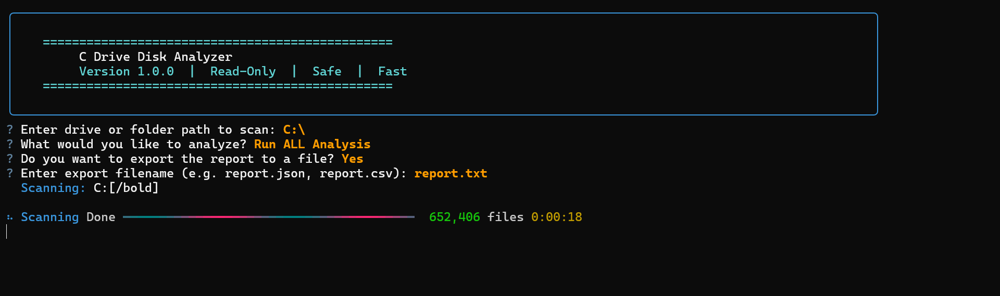
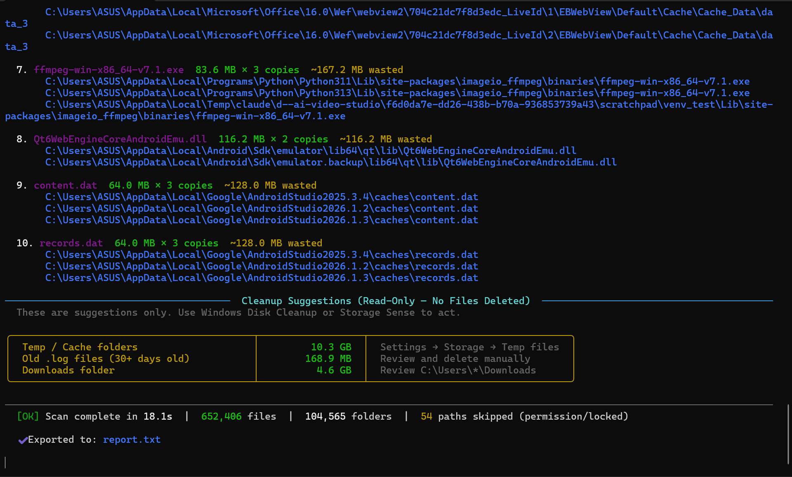
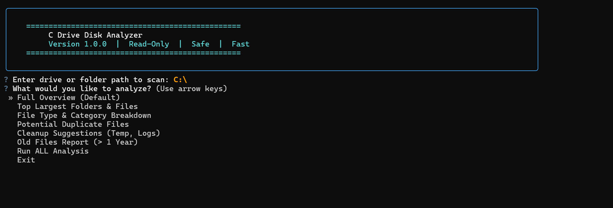

# DiskGlimpse 🔍

> A blazing fast, interactive Windows disk space analyzer for developers and power users  
> who prefer the terminal over bloated GUI tools.

[](https://github.com/atharva283/diskglimpse/releases/latest)
[](https://python.org)
[](LICENSE)
[](https://github.com/atharva283/diskglimpse/releases/latest)

---

## 📸 Screenshots







---

## 🌟 Key Features

| Feature | Description |
|---|---|
| 🖥️ **Interactive TUI** | Real-time progress, drill-down navigation, rich summary table |
| 🔍 **Smart Junk Detection** | Flags Developer Cache & System Junk automatically |
| 🗑️ **Safe Cleanup** | User-controlled checkbox selection + explicit confirmation — nothing auto-deleted |
| ⚡ **Blazing Fast** | BFS + `os.scandir()` — scans millions of files with minimal RAM |
| 🛡️ **Zero-Crash** | Handles permission errors, reparse points, and locked system dirs gracefully |
| 📤 **Export** | Save results to `JSON` or `CSV` for further analysis |
| 🎛️ **Flexible CLI** | Filter by size, extension, depth, pattern — perfect for automation |

---

## 📥 Quick Start — No Python Required

**Download the standalone `.exe` and run instantly:**

```powershell
# Step 1: Download diskglimpse.exe from the Releases page
# Step 2: Double-click — the TUI launches automatically

# Or run from PowerShell on any drive/folder:
.\diskglimpse.exe C:\
.\diskglimpse.exe D:\Projects
```

👉 **[Download diskglimpse.exe →](https://github.com/atharva283/diskglimpse/releases/latest)**

---

## 👨‍💻 Run from Source

### Requirements
- Python **3.9+**
- Windows 10 / 11

### Install & Run

```bash
git clone https://github.com/atharva283/diskglimpse.git
cd diskglimpse
pip install .
diskglimpse
```

### Developer Install (with build tools)

```bash
pip install -e ".[dev]"   # Includes PyInstaller, pytest, black, ruff
```

---

## 🎮 Usage

### Interactive Mode — Recommended

Double-clicking the `.exe` or running without flags launches the full TUI automatically:

```bash
# Launch TUI on C:\ (default)
diskglimpse

# Launch TUI on a specific drive or folder
diskglimpse D:\
diskglimpse C:\Users\YourName\Downloads
```

### CLI / Automation Mode

Use flags to bypass the TUI — great for scripts and scheduled tasks:

```bash
# Scan only 3 levels deep (much faster on large drives)
diskglimpse C:\ --max-depth 3 --interactive

# Show only files larger than 500MB
diskglimpse C:\ --min-size 500MB

# Filter by file extension (can be combined)
diskglimpse D:\Videos --ext .mp4 --ext .mkv --min-size 1GB

# Filter by filename pattern
diskglimpse C:\Users --pattern "*.log"

# Include hidden files and folders
diskglimpse C:\ --interactive --include-hidden

# Export scan results
diskglimpse C:\ --export-json report.json --export-csv report.csv

# Full scan with all options
diskglimpse C:\ --max-depth 5 --min-size 10MB --detect-junk --export-json scan.json --verbose
```

### All Flags Reference

| Flag | Default | Description |
|---|---|---|
| `path` | `C:\` | Target drive or directory |
| `--interactive`, `-i` | auto | Launch full interactive TUI |
| `--max-depth N` | unlimited | Max directory depth to traverse |
| `--min-size SIZE` | — | Min file size (`1KB`, `50MB`, `2GB`) |
| `--max-size SIZE` | — | Max file size |
| `--ext .EXT` | — | Filter by extension (repeatable) |
| `--pattern PATTERN` | — | Filename glob filter (e.g. `*.log`) |
| `--include-hidden` | off | Include hidden files/folders |
| `--detect-junk` | off | Show junk detection summary panel |
| `--top N` | `20` | Items to show in summary table |
| `--export-json PATH` | — | Export results to JSON |
| `--export-csv PATH` | — | Export results to CSV |
| `-v`, `--verbose` | off | Print full tracebacks on errors |
| `--version` | — | Show version and exit |

---

## 🗑️ How the Cleanup Feature Works

> Nothing is ever deleted automatically. Every deletion requires your explicit action.

DiskGlimpse uses a **4-layer safety process:**

```
1. junk_detector.py    →  Scans results and ONLY flags potential junk (read-only)
2. Checkbox Menu       →  YOU manually select which flagged items to include
3. Confirmation Prompt →  "⚠️ Are you sure?" shown with full item list
                          (default answer is always NO)
4. Deletion            →  Only executes after your explicit YES
```

**What gets flagged:**

| Category | Examples |
|---|---|
| 🟠 **Developer Cache** | `node_modules`, `__pycache__`, `venv`, `.venv`, `env`, `build`, `dist`, `.pytest_cache`, `.mypy_cache`, `.gradle`, `target` |
| 🔴 **System Junk** | `Temp`, `tmp`, `Cache`, browser caches (Chrome/Edge/Firefox), `.log`, `.tmp`, `.bak`, `.swp` |

> **Note:** System-critical paths — `System Volume Information`, `$RECYCLE.BIN`, `ProgramData`, `AppData`, `Windows.old` — are **never scanned**. They are silently skipped at the BFS engine level before any analysis begins.

---

## 🛠️ Build the EXE Yourself

```bash
pip install -e ".[dev]"
pyinstaller diskglimpse.spec
# Output → dist/diskglimpse.exe
```

See [BUILD_INSTRUCTIONS.md](BUILD_INSTRUCTIONS.md) for full CI/CD and packaging details.

---

## 🧱 Tech Stack

| Layer | Technology |
|---|---|
| Language | Python 3.9+ |
| TUI & Tables | [`rich`](https://github.com/Textualize/rich) ≥ 13.0 |
| Interactive Menus | [`questionary`](https://github.com/tmbo/questionary) ≥ 2.0 |
| Packaging | `pyproject.toml` — PEP 517/518 compliant |
| Build | PyInstaller via `diskglimpse.spec` |
| CI/CD | GitHub Actions — auto-builds `diskglimpse.exe` on every release tag |
| Scan Engine | Iterative BFS with `os.scandir()` + cached `DirEntry` attributes |

---

## 📄 License

This project is licensed under the **MIT License** — see the [LICENSE](LICENSE) file for details.
